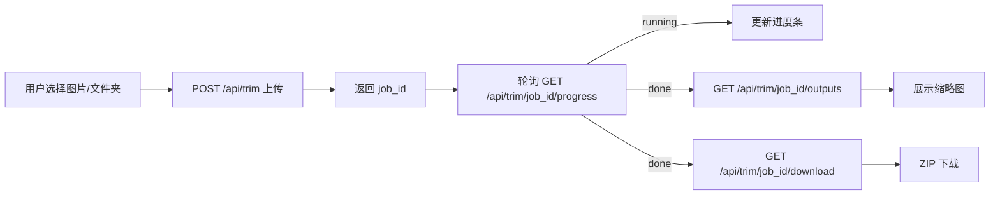

## 抠图工具介绍
  这是用python的fastapi框架使用rembg库实现的前后端抠图工具，直接运行fastapi1.py，然后浏览器打开 http://127.0.0.1:8000 网址即可。
  如图所示：
  

## 总体思路

- 后端使用 `fastapi1.py` 提供上传/进度/结果接口。
- 抠图处理逻辑“参考” `tool1.py`：复用其中的 `process_one()` 与 `get_thread_session()`（并发线程池里逐张处理），但在后端包装一层以便计算 `done/total` 进度。
- 前端上传后先拿到 `job_id`，再通过“轮询”接口更新进度条；处理完成后返回 ZIP 下载链接，并拉取输出文件列表用于展示缩略图。

## 数据流（轮询版）

## 后端改动（[e:/python-study/python/fastapi/fastapi1.py](e:/python-study/python/fastapi/fastapi1.py)）

- 创建 FastAPI 应用与路由：
  - `GET /`：返回根目录的 `index.html`。
  - `POST /api/trim`：接收多文件上传（包含目录上传的相对路径）。
    - 进入任务前先清空 `cache/inputImg` 与 `cache/outputImg`（按“当前实现只有一个公共 cache”的要求，建议加全局互斥锁，避免并发互相清空）。
    - 将上传文件保存到 `cache/inputImg/<相对路径>`（需要做路径穿越防护/清理 `..`）。
    - 计算本次待处理图片总数 `total`（递归遍历 `inputImg`，过滤 jpg/jpeg/png/webp/bmp）。
    - 启动后台线程跑抠图：
      - 复用 `tool1.process_one(img_path, output_path)`。
      - 并发：用 `ThreadPoolExecutor`；每张完成后更新 `JOBS[job_id]` 的 `done/ok/fail/status`。
    - 立即返回 `{"job_id": ...}` 给前端。
  - `GET /api/trim/{job_id}/progress`：返回 `status,total,done,progress_percent,ok,fail,message`。
  - `GET /api/trim/{job_id}/outputs`：当 `done` 时返回输出文件相对路径列表（用于前端 `` 展示）。
  - `GET /api/trim/{job_id}/download`：把 `cache/outputImg` 递归打包成 ZIP 返回。
- 静态资源：
  - 通过 `app.mount("/cache", StaticFiles(directory="cache"))` 让前端可以直接访问 `/cache/outputImg/...` 来展示缩略图。

## 前端新增（[e:/python-study/python/fastapi/index.html](e:/python-study/python/fastapi/index.html)）

- UI：卡片布局 + 美化样式 + 进度条。
- 上传控件：
  - “上传图片”：`<input type="file" multiple accept="image/*">`
  - “上传文件夹”：`<input type="file" webkitdirectory multiple accept="image/*">`
- 交互：
  1. 点击“开始抠图”，收集用户选中的 `File` 列表（优先文件夹或图片都可，但要明确二选一/合并策略；默认按“合并所有选项”）。
  2. `FormData` 里逐个 `append('files', file, file.webkitRelativePath || file.name)`，确保后端拿到相对路径（便于还原目录结构）。
  3. `fetch('/api/trim', {method:'POST', body:formData})` 得到 `job_id`。
  4. 用 `setInterval` 轮询 `GET /api/trim/{job_id}/progress`：
     - 更新进度条宽度 `progress_percent`。
     - 显示文字：`done/total`、失败数等。
     - 当 `status==='done'` 或 `error`：停止轮询。
  5. `done` 后：
     - `GET /api/trim/{job_id}/outputs` 渲染缩略图网格（可选）。
     - 同时展示“下载 ZIP”按钮：链接到 `/api/trim/{job_id}/download`。

## 关键实现点（避免卡住）

- `tool1.py` 没有进度回调，因此需要在后端包装并发：通过 `as_completed()` 来统计已完成数量，从而得到精确进度。
- 目录上传会产生 `webkitRelativePath`，后端需要把它作为相对路径保存到 `cache/inputImg`，并在枚举阶段递归遍历输出。
- 多线程并发时，依旧复用 `tool1.get_thread_session()`（它通过 `threading.local()` 做了每线程独立 session）。

## 手动验证清单

- 启动服务后：浏览器打开 `/`。
- 上传单张图片：进度条应从 0% 到 100%，最终能看到预览缩略图并可下载 ZIP。
- 上传图片文件夹（含多层子目录）：进度条应正确反映总图片数，输出 ZIP/预览应包含全部图片。
- 重复上传：每次上传前 `cache/inputImg` 与 `cache/outputImg` 应被清空（无旧文件残留）。
